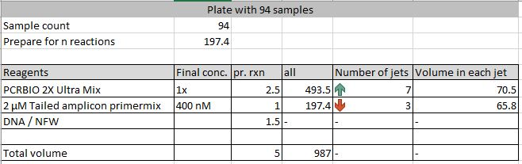
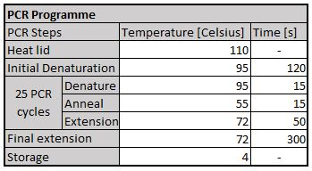
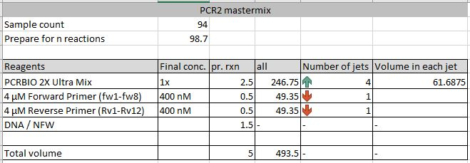
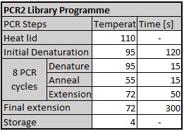

# High-Throughput Downscaled Amplicon Library Protocol

## Consumables

## Protocol

### Amplicon PCR1 (PCR1-abV4-C)

- Turn on the flow in the LAF bench 20 min before use.
- Clean the laf bench with 80% EtOH, followed by RNase AWAY™ Surface Decontaminant.
- Place a iceblock, primers, Ultramix, NF-water (open the lid) and the plasticware (2x skirted PCR-plates with associated strip-caps, 1x Dispendix pureplate 90 nm, 1x foil, and 1x Eppendorf tube) in the laf bench and UV it for 15 minutes.
- Prepare the 2 µM primer mix by adding 2 µL of each primer (Fw and Rv) to 96 µL NFW and mix by pipetting.
- Prepare the Dispendix pure plate for the I-DOT:
  - Add the calculated amount of reagents to the predetermined jets (NFW, 2x Ultramix and 2µM primer mix). Ex:
    - 2 jets with 80 µL NFW
    - 6 jets with 68,25 µL 2x Ultramix
    - 3 jets with 54,6 µL Primer mix

- Move the PCR plate to the DNA work station and add 5 µl of template to the predetermined jets with a multipipette.
- Place the filled dispendix source plate in the upper chamber on the I-DOT and an empty PCR-plate in the lowest chamber.
- Check that the protocol is consistent to the loaded jets. If yes, start to dispense.
- When the dispensing is done check the results, if everything is fine, close the PCR-plate with the strip-caps. (Redo with the 2nd plate)
- Briefly vortex the plate(s) and then briefly centrifuge the plate(s).
- Run the 2 plates on each their own PCR-machine with this program:

### Clean NGS clean-up

- Protocol is based on Agencourt AMPure XP PCR Purification manual (B37419AB).
- Pool duplicate PCR reactions.
- Add 8 µL of Clean NGS bead solution (room temperature) to each PCR reaction of 10 µL and mix by gently pipetting up and down 10 times.
- Incubate for 5 minutes at room temperature.
- Place PCR tube/PCR plate in a magnetic stand until liquid is clear (Up to 3 minutes).
- Remove liquid with pipette and discard it, without disturbing the bead pellets.
- Wash the bead pellets with 40 µL 80% ethanol by gently aspirating it over the bead pellet with a pipette, and incubate for 30 seconds at room temperature.
- Repeat above step once.
- Let remaining ethanol settle at the bottom of the containers and remove with 10 µL pipette.
- Dry the bead pellet for 5 minutes to evaporate residual ethanol.
- Remove the PCR plate from magnetic stand.
- Add 15 µL nuclease free water to each well and resuspend the bead pellet by pipetting.
- Incubate for 2 minutes at room temperature.
- Return the PCR plate to the magnetic stand and wait until the liquid clears.
- Continue to next step.

### PCR1 Amplicon concentration measurement

- Measure DNA concentration of all samples using the standard protocol for Qubit HS DNA assay, with following exceptions.
  1. Perform one measurement pr. sample.
  2. Use 1 µL sample pr. measurement (directly from the plate on the magnetic stand).
  3. Re-measure samples with uncertain results or with too high concentration.
- Put the DNA concentrations in `PCR1_DNA_concentration.xlsx`.

#### Optional: Amplicon gel electrophoresis

- Use standard protocol for D1000 screentapes
  1. Choose a subset of samples to analyse (i.e. 5% of the samples plus NC and PC).
  2. Single measurement pr. sample.

## Library PCR (PCR2 - Nextera)

- Turn on the flow in the LAF bench 20 min before use.
- Clean the laf bench with 80% EtOH, followed by RNase AWAY™ Surface Decontaminant.
- Place a iceblock, primers, Ultramix, NF-water(open the lid) and the plasticware (1x skirted PCR-plates with associated strip-caps, 2x Dispendix pureplate 90 nm, 1x foil, and 1x Eppendorf tube) in the laf bench and UV it for 15 minutes.
- Prepare the 48 tubes of 4 µM primer stock by adding 2 µL of primer to 48 µL NFW and mix by pipetting.
- Prepare the Dispendix pure plate for the I-DOT:
  - Add the calculated amount of reagents to the predetermined jets (NFW, 2x Ultramix and 4µM single primer).

- Move the PCR plate to the DNA work station and add 5 µl of template to the predetermined jets with a multipipette.
- Place the filled dispendix source plate in the upper chamber on the I-DOT and an empty PCR-plate in the lowest chamber.
- Check that the protocol is consistent to the loaded jets. If yes, start to dispense.
- When the dispensing is done check the results, if everything is fine, close the PCR-plate with the strip-caps.
- Briefly vortex the plate and then briefly centrifuge the plate.
- Run the plate on a PCR-machine with the following program:

### Clean NGS cleanup

- Protocol is based on Agencourt AMPure XP PCR Purification manual (B37419AB).
- Add 4 µL of Clean NGS bead solution (room temperature) to each PCR reaction of 5 µL and mix by gently pipetting up and down 10 times.
- Incubate for 5 minutes at room temperature.
- Place PCR tube/PCR plate in a magnetic stand until liquid is clear (Up to 3 minutes).
- Remove liquid with pipette and discard it, without disturbing the bead pellets.
- Wash the bead pellets with 40 µL 80% ethanol by gently aspirating it over the bead pellet with a pipette, and incubate for 30 seconds at room temperature.
- Repeat above step once.
- Let remaining ethanol settle at the bottom of the containers and remove with 10 µL pipette.
- Dry the bead pellet for 5 minutes to evaporate residual ethanol.
- Remove the PCR tube/PCR plate from magnetic stand.
- Add 22 µL nuclease free water to each well and resuspend the bead pellet by pipetting.
- Return the PCR tube/PCR plate to the magnetic stand and wait until the liquid clears.
- Transfer 20 µL of the liquid to a new PCR plate.

### PCR2 Amplicon concentration measurement

- Measure DNA concentration of all samples using the standard protocol for Qubit HS DNA assay, with following exceptions.
  1. Perform one measurement pr. sample.
  2. Use 1 µL sample pr. measurement (directly from the plate on the magnetic stand).
  3. Re-measure samples with uncertain results or with too high concentration.
- Put the DNA concentrations in `PCR2_DNA_concentration.xlsx`.

#### Optional: Amplicon gel electrophoresis

- Use standard protocol for D1000 screentapes
  1. Choose a subset of samples to analyse (i.e. 5% of the samples plus NC and PC).
  2. Single measurement pr. sample.

### Pool samples

Pool samples based on the "library pooling" column in the "Library_concentration" file above.

#### Pool concentration measurement

- Measure DNA concentration of pool using the standard protocol for Qubit HS DNA assay, with following exceptions.
  1. Perform triplicate measurement pr. pool.
  2. Use 2 µL pool pr. measurement.
